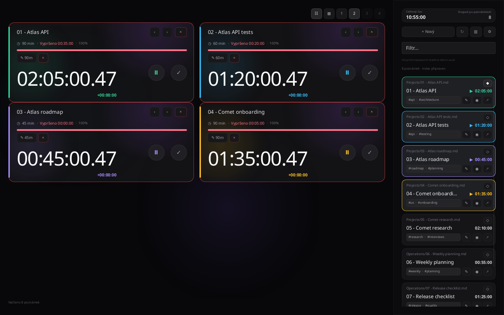
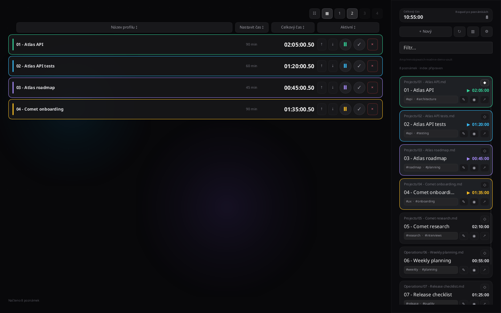
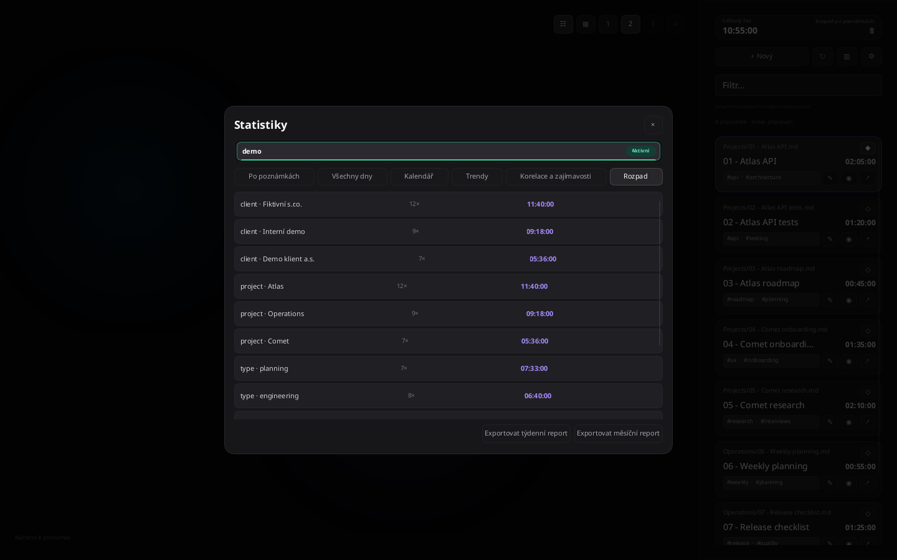
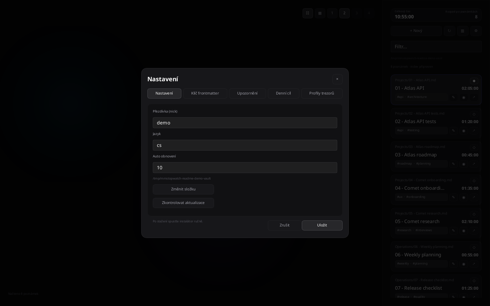

# mmStopWatch

[](CHANGELOG.md)
[](https://github.com/LucasHefi/mmStopWatch/actions/workflows/slint-native-release.yml)
[](LICENSE)
[](https://www.rust-lang.org/)
[](https://slint.dev/)

[English](README.md) · [Čeština](README.cs.md)

Native, local-first time tracking for Markdown notes and Obsidian vaults. The application writes tracked time to the `Timework` frontmatter field, keeps compatible activity history, and works directly with the selected vault.

## Product scope

The stable product is the single native Slint application in `src-slint/`. It does not use React, Vite, the DOM, WebView, Tauri, or a JavaScript runtime. Data stays local, with no account, cloud service, or telemetry.

## Features

- multiple independent monotonic timers with pause/resume/save/discard;
- checkpoint recovery after an unexpected exit without automatic resume;
- safe atomic Markdown writes with external-conflict detection;
- a fast, rebuildable SQLite index over the Markdown source of truth;
- search, previews, tags, pinning, new notes, and Obsidian deep links;
- vault profiles, onboarding, goals, estimates, statistics, calendar, reports, and notifications;
- 15 built-in language catalogs;
- a software renderer with limited decorative animation and a virtualized list.

## Screenshots

These are real snapshots of the native Slint application using a demonstration vault. All project names, profiles, times, tags, and activity history are **fictional**; no user data was used.

### Timer cards

Practical example: several concurrent work blocks for the fictional **Atlas** and **Comet** projects, with estimates, progress, and controls for pausing, saving, or discarding a timer.



### Timer table

Practical example: quickly sort multiple timers by profile name, estimate, total time, or active state.



### Statistics and field breakdown

Practical example: compare fictional clients, projects, and work types; the view can also be switched to notes, days, calendar, or trends.



### Profile and vault settings

Practical example: configure the `demo` profile, language, automatic-refresh interval, notes location, and manual update checks.



The image files are stored in [`docs/screenshots/`](docs/screenshots/).

## Quick start

Requirements: Rust stable, Cargo, and on Linux `libfontconfig1-dev` and `libxkbcommon-dev`.

```bash
cargo run --manifest-path src-slint/Cargo.toml --release
```

Pass a vault as the first argument:

```bash
cargo run --manifest-path src-slint/Cargo.toml --release -- /path/to/vault
```

## Local verification

```bash
cargo fmt --manifest-path src-slint/Cargo.toml -- --check
cargo test --manifest-path src-slint/Cargo.toml --locked
cargo clippy --manifest-path src-slint/Cargo.toml --all-targets --locked -- -D warnings
cargo build --manifest-path src-slint/Cargo.toml --release --locked
bash src-slint/packaging/check-assets.sh
bash src-slint/packaging/linux/package-deb.sh
```

`target/` and packages are generated artifacts and do not belong in Git history.

## Distribution

The `v1.7.5` tag and subsequent stable tags trigger the [Slint release workflow](.github/workflows/slint-native-release.yml). The workflow verifies Rust and builds and publishes platform installers:

- Linux x86_64: `.deb`;
- Windows x86_64: per-user NSIS `.exe`;
- macOS arm64: `.dmg` containing an `.app`, provided the macOS runner passes its gates.

Each GitHub Release contains unambiguous asset names, SHA-256 checksums, build metadata, and `latest.json`. A missing or duplicate asset is a hard failure. Artifacts are not committed to the repository.

The installers in this release are not issued as OS-signed or notarized packages. Checksums protect downloaded content against silent changes; Windows SmartScreen and macOS Gatekeeper may show a warning before the first launch.

## Updates

The application performs only an explicit check of the public GitHub Release manifest. The manifest is validated as JSON with strict semver, an HTTPS GitHub URL, a platform asset, and an exact SHA-256 checksum. The button opens the installer download in the system browser; the user starts the installation manually. The application itself does not download, install, or restart.

## Data and security

- Markdown files are the only source of truth.
- `config.json` and `activity.json` are stored in `.mmST-{nick}` inside the selected vault.
- The SQLite index is a rebuildable local cache outside the synchronized vault.
- Paths are validated against the selected root; traversal, absolute/UNC paths, control characters, and symlink escapes are rejected.
- The application sends no data to a remote server apart from an explicit release-manifest check.

See the [security threat model](docs/security-threat-model.md) and [acceptance checklist](docs/acceptance.md) for details.

## License

MIT © [Lukáš Hefner](https://mediamaker.cz)
